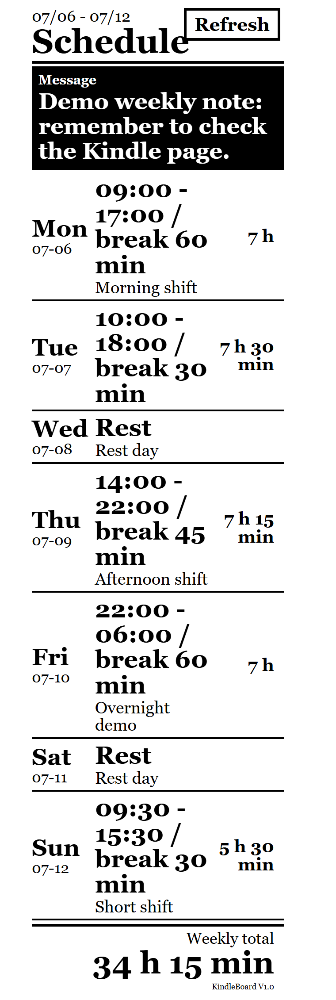

# KindleBoard

**Current version:** `V1.1`

KindleBoard is a self-hosted Kindle and e-ink dashboard for Docker. It gives an old Kindle Paperwhite a second life as an always-visible personal board for a weekly schedule, memo, or to-do list.



KindleBoard is designed for trusted private-network use. Run it inside a private Docker environment, or protect it with a VPN, reverse proxy, or authentication layer before exposing it to the public internet.

## Documentation Languages

- [简体中文](docs/README.zh-CN.md)
- [繁體中文](docs/README.zh-TW.md)
- [日本語](docs/README.ja.md)
- [한국어](docs/README.ko.md)
- [Español](docs/README.es.md)
- [Deutsch](docs/README.de.md)
- [Français](docs/README.fr.md)
- [Português](docs/README.pt.md)

## Why KindleBoard

Kindle browsers are old, slow, and limited, but e-ink screens are excellent for quiet, persistent information. KindleBoard keeps the interface simple: large text, high contrast, minimal interactions, and no heavy frontend framework.

The application is intentionally local-first. It uses one SQLite database and does not require Redis, PostgreSQL, MySQL, or any external service.

## Features

- Personal weekly schedule with daily shifts, rest days, notes, and automatic weekly total hours.
- Overnight shift support, such as `22:00` to `06:00`.
- Memo mode for large readable notes.
- To-do list mode with tap-to-complete support directly on Kindle.
- Admin page for editing content and switching display modes.
- Database backup download and local database restore upload.
- Kindle-optimized display page with a large refresh button.
- One SQLite database for schedule, memo, to-do items, display mode, and language settings.
- Multilingual UI.
- Docker-ready deployment.
- Default port: `10000`.

## V1.1 Highlights

- Added database backup download from the admin page.
- Added local SQLite database restore upload with validation.
- Added drag-and-drop support for restore files.
- The admin page opens the Kindle display page in a new browser tab.

## Display Modes

KindleBoard has three display modes:

- **Schedule**: weekly schedule and total work hours.
- **Memo**: one large note or message.
- **To-do**: clickable task list. Items can be completed or reopened from the Kindle page.

Only the selected mode is shown on the Kindle display page.

## Supported Interface Languages

English, Simplified Chinese, Traditional Chinese, Japanese, Korean, Spanish, German, French, and Portuguese.

The default language follows the browser language. The included demo database uses English by default. After you choose and save a language in the admin page, KindleBoard will use the saved language for both the admin page and the Kindle page.

## Docker Installation

Published image:

```text
neil2046/kindleboard:latest
```

Mirror image:

```text
ghcr.io/neil2046/kindleboard:latest
```

## Maintainer Publishing

The GitHub Actions workflow always publishes the GHCR image. Docker Hub publishing is optional and runs only when these repository secrets are configured:

```text
DOCKERHUB_USERNAME
DOCKERHUB_TOKEN
```

If either secret is missing, the workflow skips Docker Hub and still publishes to GHCR.

Before enabling Docker Hub publishing, create a Docker Hub repository named `kindleboard` under the same account used in `DOCKERHUB_USERNAME`, and make sure the access token has read/write permission for that repository.

### Option A: Docker Compose

Create a project folder:

```bash
mkdir kindleboard
cd kindleboard
```

Create `docker-compose.yml`:

```yaml
services:
  kindleboard:
    image: neil2046/kindleboard:latest
    container_name: kindleboard
    ports:
      - "10000:10000"
    volumes:
      - ./data:/data
    restart: unless-stopped
```

Start the container:

```bash
docker compose up -d
```

Open:

```text
Admin:  http://SERVER-IP:10000/admin
Kindle: http://SERVER-IP:10000/kindle
```

Replace `SERVER-IP` with the IP address of the machine running Docker.

### Option B: docker run

Run the command from the folder where you want KindleBoard to store its `data` directory:

```bash
docker run -d \
  --name kindleboard \
  -p 10000:10000 \
  -v ./data:/data \
  --restart unless-stopped \
  neil2046/kindleboard:latest
```

GHCR mirror:

```bash
docker run -d \
  --name kindleboard \
  -p 10000:10000 \
  -v ./data:/data \
  --restart unless-stopped \
  ghcr.io/neil2046/kindleboard:latest
```

## Data Persistence

Data is stored in:

```text
./data/schedule.db
```

Schedule, memo, to-do items, display mode, and language settings are all stored in this single SQLite database.

The Docker image includes a default English demo database. On first start, if `/data/schedule.db` does not exist, KindleBoard copies the demo database into `/data/schedule.db`. Existing user data is never overwritten.

Do not delete the `data` folder unless you intentionally want to reset the application.

The admin page includes database tools for downloading a SQLite backup and restoring from a local KindleBoard database backup file.

SQLite runtime helper files are ignored by Git:

```text
data/schedule.db-wal
data/schedule.db-shm
```

## Upgrade

Pull the latest image and restart:

```bash
docker compose pull
docker compose up -d
```

Your data remains in `./data/schedule.db`.

## Build From Source

Most users should use the published Docker image. To build locally:

```yaml
services:
  kindleboard:
    build: .
    container_name: kindleboard
    ports:
      - "10000:10000"
    volumes:
      - ./data:/data
    restart: unless-stopped
```

Then run:

```bash
docker compose up -d --build
```

## Kindle Usage Notes

- Open `http://SERVER-IP:10000/kindle` on the Kindle browser.
- Keep the Kindle connected to the same reachable network as the Docker host.
- The page includes a large refresh button so you do not need to use the browser toolbar.
- Kindle browser toolbars and screen saver behavior are controlled by Kindle OS, not by KindleBoard.
- Keeping Wi-Fi and front light on will use more battery.

## Security Notes

KindleBoard does not include user accounts or login protection. It is meant for trusted personal environments. If you expose it outside a private network, place it behind a VPN, reverse proxy authentication, or another access-control layer.
